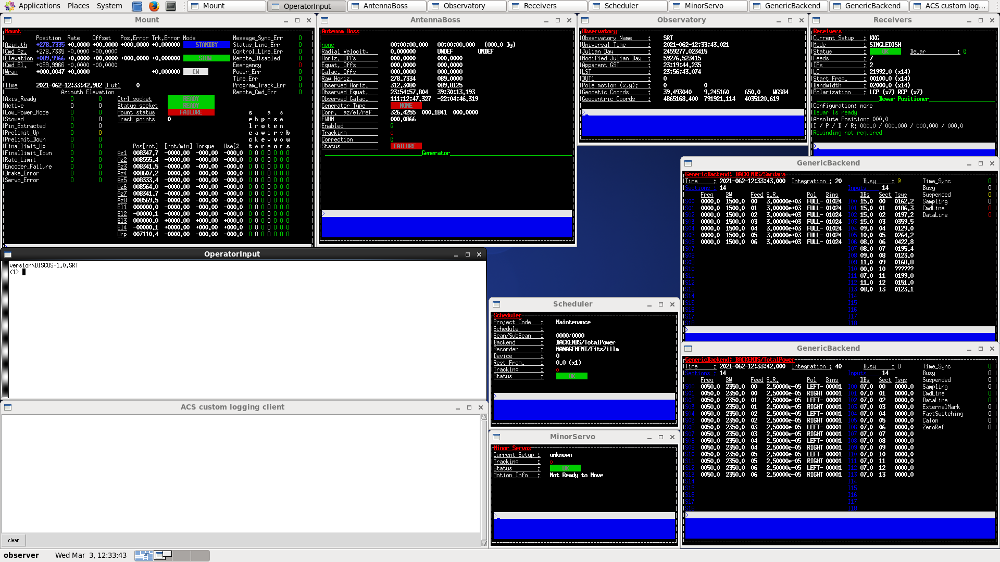

.. _intro:

.. role:: bi
   :class: bolditalic

************
Introduction
************

About this project
==================

.. only:: html

   :bi:`DISCOS Deployment`: **a tool for automated provision and deployment
   of the** :bi:`DISCOS` **machines**

.. raw:: latex

   \textbf{\textit{DISCOS Deployment}: a tool for automated provision and
   deployment of the \textit{DISCOS} machines}\\
   Giuseppe Carboni <\texttt{giuseppe.carboni@inaf.it}>
   \vspace{0.5cm}

This document describes the :bi:`DISCOS Deployment` tool. This tool was
designed with the purpose of providing an automated procedure capable of
provisioning the machines on which the `DISCOS` control software will run,
and deploying all the necessary software needed by it in order to run correctly.

Having a completely automated procedure to prepare the control software
machines brings several advantages:

* It allows to repeatedly perform a complex series of ordered tasks such
  as installing dependencies, copying configuration files, preparing the
  user environment and having (almost) every time the same overall
  configuration of a machine that was provisioned by using the same procedure;
* It minimizes human errors that can occur when the number of ordered tasks
  to be applied on a machine in order for it to be correctly configured
  increases dramatically;
* It can be scheduled to run automatically, both in a production environment,
  in order to keep machines updated, and in a virtual environment, by the means
  of `continuous integration` :cite:`duvall2007continuous`, in order to
  periodically test the correctness of the procedure and spot eventual failing tasks;
* It can configure several machines in parallel, when they all share the same
  configuration (or part of it), dramatically reducing the time needed to bring
  up a new complete working environment.

.. only:: latex

   :ref:`Chapter two<howitworks>` of this document explains how the procedure
   operates, describing its underlying tools and technologies.
   :ref:`Chapter three<dependencies>` of this document lists and explains how to install the
   dependencies needed by this tool in order to run.
   :ref:`Chapter four<deploy_quickstart>` describes the steps to be undertaken in order to install
   the tool and provision a `DISCOS` virtual machine.
   :ref:`Chapter five<dependencies>` of this document describes

.. raw:: latex

   \newpage

.. _discos_cs:

The `DISCOS` Control Software
=============================
The following paragraph describes the `DISCOS` control software. These lines
were taken from the official `DISCOS` documentation. :cite:`DISCOS`

`"`:bi:`DISCOS` (:bi:`D`\ `evelopment of the` :bi:`I`\ `talian` :bi:`S`\
`ingle-dish` :bi:`CO`\ `ntrol` :bi:`S`\ `ystem) is the control software
produced for the Italian radio telescopes. It is a distributed system based on`
:bi:`ACS` (:bi:`A`\ `LMA` :bi:`C`\ `ommon` :bi:`S`\ `oftware)`
:cite:`chiozzi2004alma` `commanding all the devices of the telescope and
allowing the user to perform single-dish observations in the most common
modes. As of today, the code specifically implemented for the telescopes
(i.e. excluding the huge ACS framework) amounts to about 650000 lines. Even
VLBI (or guest-backend) observations partly rely on DISCOS, as it must be used
to perform the focus selection and the frontend setup."`

.. _console:

   The `DISCOS` console user interface.

.. only:: html

   .. figure:: images/console-2.png

      The SRT Active Surface and Weather Client user interfaces.
